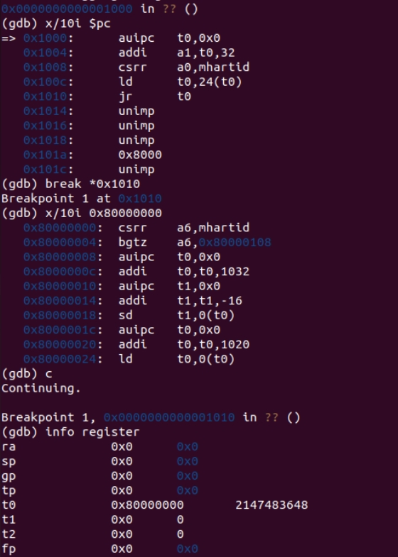
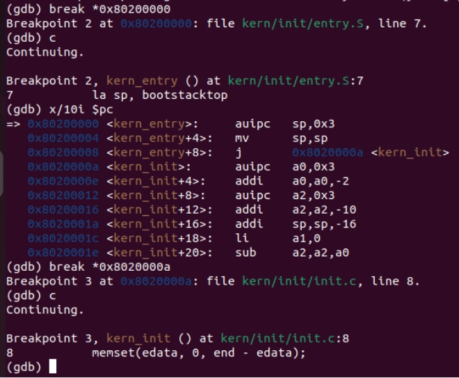
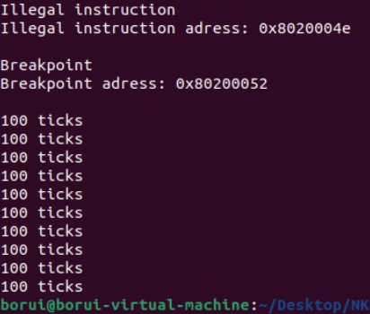

# OS Lab0-1

**作者：2111511 张波睿**

## 目录
1. [Lab0](#lab0)
2. [Lab0.5](#lab05)
    1. [练习](#练习)
3. [Lab1](#lab1)
    1. [练习1](#练习1)
    2. [练习2](#练习2)
    3. [扩展练习](#扩展练习)
    4. [扩展练习2](#扩展练习2)
    5. [扩展练习3](#扩展练习3)
4. [知识点说明](#知识点说明)

## Lab0
本人实验环境配置在了通过VMware运行的Ubuntu22.04版本Linux虚拟机中。其中编译器可执行文件版本为：`riscv64-unknown-elf-toolchain-10.2.0-2020.12.8-x86_64-linux-ubuntu14`；模拟器版本为：`qemu-4.1.1`。

## Lab0.5

### 练习


通过这个结果我们可以看到，0x1010处处理器跳转到t0，而此时t0的值为0x80000000，也就是我们从0x1010跳转到了0x80000000。
在跳转之前，处理器通过先存高32位再加低位的方式将当前pc+32存入a1，然后从mhartid中读取当前硬件线程的ID保存到a0中存储下来，再将t0+24处的内容加载到t0后跳转。



在这个结果中，我们可以看到8x20000000处是在kern_entry中初始化sp，然后刷新sp（这里我不太理解为什么要多做一步），然后跳转到kern_init的地址进入真正的入口。也就是说在0x8000000a我们才开始让操作系统接管整个系统。

总结这个过程：第一阶段，qemu将pc初始化到0x1010，存储线程ID后跳转到bootloader（0x80000000）；第二阶段，从0x80000000开始RustSBI开始初始化，待其完成后跳转至kern_entry（0x80200000）；第三阶段，初始化栈指针等操作后跳转到操作系统内核真正的入口（0x8020000a）。


## Lab1

### 练习1
1. la sp, bootstacktop: 这条指令是将内核启动时的堆栈顶地址初始化给堆栈指针sp。目的是为了确保处理器有一个有效的堆栈来执行后续的一系列操作。
2. tail kern_init: 这条指令完成了跳转到kern_init且不返回。tail 指令不会进行函数返回操作，执行这条指令的目的是让处理器直接跳转到kern_init且不保留当前函数的调用，以此来减少内核初始化时的栈开销。

### 练习2
```c
void interrupt_handler(struct trapframe *tf) {
    intptr_t cause = (tf->cause << 1) >> 1;
    switch (cause) {
        //...
        case IRQ_S_TIMER:
            // "All bits besides SSIP and USIP in the sip register are
            // read-only." -- privileged spec1.9.1, 4.1.4, p59
            // In fact, Call sbi_set_timer will clear STIP, or you can clear it
            // directly.
            // cprintf("Supervisor timer interrupt\n");
             /* LAB1 EXERCISE2   2111511 :  */
            /*(1)设置下次时钟中断- clock_set_next_event()
             *(2)计数器（ticks）加一
             *(3)当计数器加到100的时候，我们会输出一个`100ticks`表示我们触发了100次时钟中断，同时打印次数（num）加一
            * (4)判断打印次数，当打印次数为10时，调用<sbi.h>中的关机函数关机
            */
            clock_set_next_event(); //(1)
            num++;  //(2)
            if (num >= TICK_NUM){ 
                print_ticks();
                num = 0;
                print_num++;
            }   //(3)
            if (print_num == 10){
                sbi_shutdown();
            }   //(4)
            break;
        //...
    }
}
```

### 扩展练习
1. move a0, sp: 该指令将当前堆栈指针sp赋值到a0之中。在RISC-V中，a0常常用于传递函数的第一个参数，因此a0会被trap函数进行调用。因此该指令目的是将堆栈指针传递给中断处理程序以此来使它可以管理这段栈进行后续的处理和恢复工作。
2. SAVE_ALL: 在这个宏定义中，处理器先将栈指针向低位置移动寄存器数量\*寄存器字节数（8），然后通过每个寄存器占用8字节来进行计算得到每个寄存器的确切位置（例如存入的第i个寄存器存在栈指针+i*8字节的地方。
3. __alltraps: 需要保存全部寄存器，方便应用于所有情况。

### 扩展练习2
1. csrw sscratch, sp: 该指令将堆栈指针的值写入CSR寄存器sscratch中。目的是保存在保存寄存器移动栈指针之前的栈指针地址，可以通过后续CSR寄存器保存的过程将其存入x2寄存器应存入的栈地址中，以免自己拉自己的情况。
2. csrrw s0, sscratch, x0: 该指令将sscratch中保存的原来栈指针存入s0中寄存器中，然后将sscratch的值清零（赋值上x0寄存器的值）。由于CSR寄存器无法直接写到内存，先将里面的原栈指针写入s0，再清零以作为安全保护措施。
3. CSR寄存器的保存还原问题: stval记录导致异常的地址，scause记录异常或中断的原因，因此保存他们是为了让trap程序能够读取它们来进行中断或异常处理的判断操作。不还原的原因是这些寄存器中的内容只在中断异常处理中有用，回复它们相当于做了无用功，在大量调用trap的情况下一定会影响trap效率。因此这些寄存器只会进行记录，并不进行还原。

### 扩展练习3
trap.c中补全部分：
```c
void update_epc(struct trapframe *tf){    //遇到异常跳过该指令
    uint16_t instruction16 = *(uint16_t *)(tf -> epc);
    if((instruction16 & 0x3) == 0x3){  //如果是64位指令
        tf -> epc += 4;
    }
    else{  //如果是32位压缩指令
        tf -> epc += 2;
    }
}
void exception_handler(struct trapframe *tf) {
    switch (tf->cause) {
        //...
        case CAUSE_ILLEGAL_INSTRUCTION:
             // 非法指令异常处理
             /* LAB1 CHALLENGE3   2111511 :  */
            /*(1)输出指令异常类型（ Illegal instruction）
             *(2)输出异常指令地址
             *(3)更新 tf->epc寄存器
            */
            cprintf("Illegal instruction\n");  //(1)
            cprintf("Illegal instruction adress: 0x%08x \n\n", tf -> epc);  //(2)
            update_epc(tf);  //(3)
            break;
        case CAUSE_BREAKPOINT:
            //断点异常处理
            /* LAB1 CHALLLENGE3   2111511 :  */
            /*(1)输出指令异常类型（ breakpoint）
             *(2)输出异常指令地址
             *(3)更新 tf->epc寄存器
            */
            cprintf("Breakpoint\n");  //(1)
            cprintf("Breakpoint adress: 0x%08x \n\n", tf -> epc);  //(2)
            update_epc(tf);  //(3)
            break;
      //...
}
```
init.c中测试exception_handler部分：
```c
void test_exception_handler(void){
    __asm__ __volatile__(".word 0xFFFFFFFF");   //illegal instruction test
    __asm__ __volatile__("ebreak");     //breakpoint test
}
int kern_init(void) {
    //...
    intr_enable();  // enable irq interrupt
    test_exception_handler(); //加入两种测试指令
     while (1)
        ;
}

```
lab1总体运行结果：



## 知识点说明

### 开启kern
在实验中，我们通过qemu初始化后跳转到kern_entry再跳转到kern_init实现操作系统的启动。这部分对应着操作系统原理中的处理器如何利用将操作系统导入到内存这一过程。

### 中断和异常处理
在这部分的实验中，保存和恢复寄存器中的内容对应了操作系统原理中的上下文切换情况。

### 可能没有对应上的
没有引入进程的状态转换问题以及进程间切换情况。


