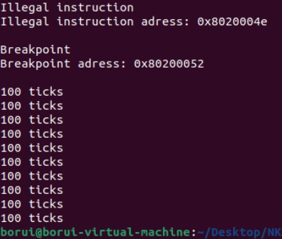

# OS Lab0-1

**作者：2111511 张波睿**

## 目录
1. [Lab0](#lab0)
2. [Lab0.5](#lab05)
    1. [练习](#练习)
    2. [重要知识点说明](#重要知识点说明)
3. [Lab1](#lab1)
    1. [练习1](#练习1)
    2. [练习2](#练习2)
    3. [扩展练习](#扩展练习)
    4. [扩展练习2](#扩展练习2)
    5. [扩展练习3](#扩展练习3)

## Lab0
本人实验环境配置在了通过VMware运行的Ubuntu22.04版本Linux虚拟机中。其中编译器可执行文件版本为：`riscv64-unknown-elf-toolchain-10.2.0-2020.12.8-x86_64-linux-ubuntu14`；模拟器版本为：`qemu-4.1.1`。

## Lab0.5

### 练习

### 重要知识点说明

## Lab1

### 练习1

### 练习2
```c
void interrupt_handler(struct trapframe *tf) {
    intptr_t cause = (tf->cause << 1) >> 1;
    switch (cause) {
        //...
        case IRQ_S_TIMER:
            // "All bits besides SSIP and USIP in the sip register are
            // read-only." -- privileged spec1.9.1, 4.1.4, p59
            // In fact, Call sbi_set_timer will clear STIP, or you can clear it
            // directly.
            // cprintf("Supervisor timer interrupt\n");
             /* LAB1 EXERCISE2   2111511 :  */
            /*(1)设置下次时钟中断- clock_set_next_event()
             *(2)计数器（ticks）加一
             *(3)当计数器加到100的时候，我们会输出一个`100ticks`表示我们触发了100次时钟中断，同时打印次数（num）加一
            * (4)判断打印次数，当打印次数为10时，调用<sbi.h>中的关机函数关机
            */
            clock_set_next_event(); //(1)
            num++;  //(2)
            if (num >= TICK_NUM){ 
                print_ticks();
                num = 0;
                print_num++;
            }   //(3)
            if (print_num == 10){
                sbi_shutdown();
            }   //(4)
            break;
        //...
    }
}
```

### 扩展练习

### 扩展练习2

### 扩展练习3
trap.c中补全部分：
```c
void update_epc(struct trapframe *tf){    //遇到异常跳过该指令
    uint16_t instruction16 = *(uint16_t *)(tf -> epc);
    if((instruction16 & 0x3) == 0x3){  //如果是64位指令
        tf -> epc += 4;
    }
    else{  //如果是32位压缩指令
        tf -> epc += 2;
    }
}
void exception_handler(struct trapframe *tf) {
    switch (tf->cause) {
        //...
        case CAUSE_ILLEGAL_INSTRUCTION:
             // 非法指令异常处理
             /* LAB1 CHALLENGE3   2111511 :  */
            /*(1)输出指令异常类型（ Illegal instruction）
             *(2)输出异常指令地址
             *(3)更新 tf->epc寄存器
            */
            cprintf("Illegal instruction\n");  //(1)
            cprintf("Illegal instruction adress: 0x%08x \n\n", tf -> epc);  //(2)
            update_epc(tf);  //(3)
            break;
        case CAUSE_BREAKPOINT:
            //断点异常处理
            /* LAB1 CHALLLENGE3   2111511 :  */
            /*(1)输出指令异常类型（ breakpoint）
             *(2)输出异常指令地址
             *(3)更新 tf->epc寄存器
            */
            cprintf("Breakpoint\n");  //(1)
            cprintf("Breakpoint adress: 0x%08x \n\n", tf -> epc);  //(2)
            update_epc(tf);  //(3)
            break;
      //...
}
```
init.c中测试exception_handler部分：
```c
void test_exception_handler(void){
    __asm__ __volatile__(".word 0xFFFFFFFF");   //illegal instruction test
    __asm__ __volatile__("ebreak");     //breakpoint test
}
int kern_init(void) {
    //...
    intr_enable();  // enable irq interrupt
    test_exception_handler(); //加入两种测试指令
     while (1)
        ;
}

```
lab1总体运行结果：




